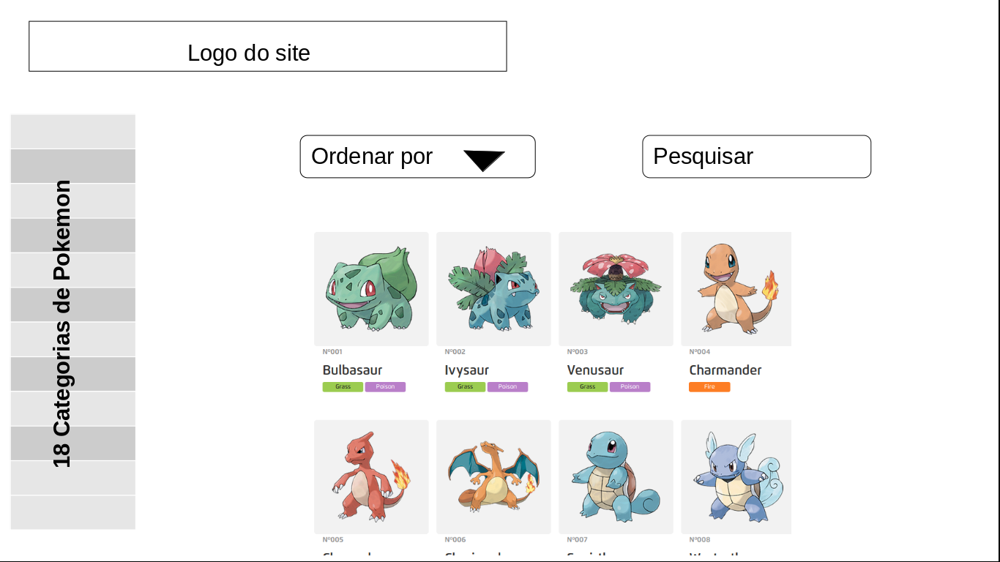
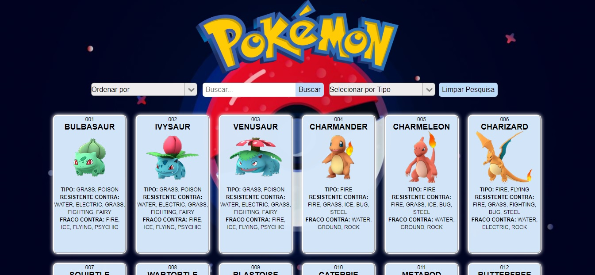

# Pokémon

Acesse a aplicação aqui: https://gabrielasilva1991.github.io/SAP005-data-lovers/

## Índice

* [1. Apresentação](#1-apresentação)
* [2. Sobre o Projeto](#2-sobre-o-projeto)
* [3. Necessidade dos Usuários](#3-necessidade-dos-usuários)
* [4. Desenho de Interface do Usuário](#4-desenho-de-interface-do-usuário)
* [5. Ferramentas Utilizadas](#7-ferramentas-utilizadas)
* [6. Desenvolvedora](#8-desenvolvedora)

***

## 1. Apresentação

Projeto realizado durante o Bootcamp Laboratória - SAP005, com intuito de criar uma interface web onde se possa visualizar e manipular dados, entendendo o que o usuário necessita.

## 2. Sobre o projeto

A aplicação oferece informações para os usuários fãs de Pokémons.

Eles podem fazer a _busca_ por:

* _Nome_ de Pokémon, 

* Ordem crescente e decrescente de _nome_ ou _número_,

* Filtrar por _tipo_ vendo a porcentagem do total de todos Pokémons que esse tipo representa.

## 3. Necessidade dos Usuários

Foi realizada uma pesquisa com os usuários através de formulários e então identificadas as principais informações que esses usuários gostariam de ver em uma aplicação sobre Pokémons:

- :warning: Fazer busca pelo nome
- :warning: Visualizar por tipo
- :warning: Visualizar Resistências 
- :warning: Visualizar Fraquezas

## 4. Desenho de Interface do Usuário 

### Protótipo Inicial

Foi desenvolvido inicialmente  no seguinte modelo:

  

<!--  -->

### Protótipo Final

O layout foi alterado para melhor visualização das informações pelos usuários.

  

<!--  -->

## 5. Ferramentas Utilizadas

- ✅ HTML5
- ✅ CSS3
- ✅ Javascript
- ✅ GitHub
- ✅ GitHub Pages
- ✅ Node.js
- ✅ Jest.

## 6. Desenvolvedora 

[Gabriela Silva](https://github.com/gabrielasilva1991)
