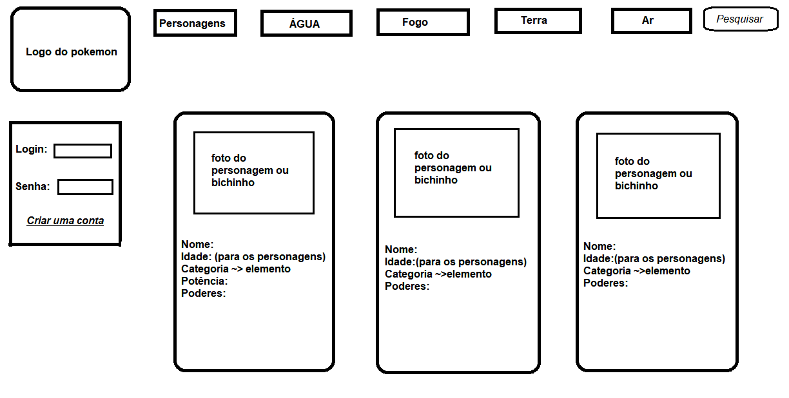
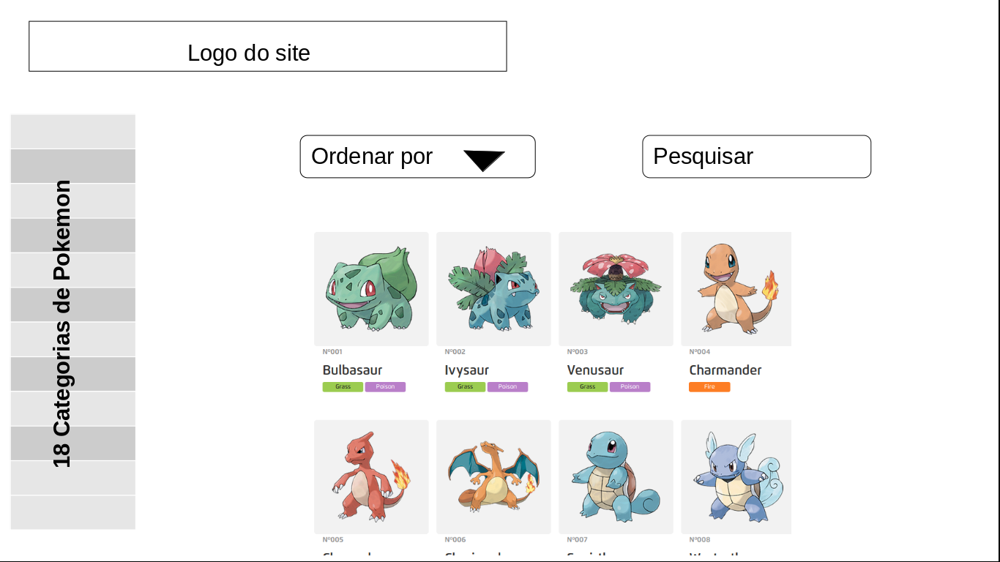

# Data Lovers - Pokémon Web 

## Índice

* [1. Projeto](#1-projeto)
* [2. Desenvolvimento do Projeto](#2-desenvolvimento-do-projeto)
* [3. Necessidade do Usuário](#3-necessidade-do-usuário)
* [4. Desenho de interface do usuário](#4-desenho-de-interface-do-usuário)
* [5. O que o usuário já vai ter acesso](#5-o-que-o-usuário-já-vai-ter-acesso)
* [6. O que em breve estará disponível](#6-o-que-em-breve-já-vai-ter-acesso)
* [7. Aqui vai o link da aplicação](#7-aqui-vai-o-link-da-aplicação)
* [8. Desenvolvido por](#8-desenvolvido-por)

***

## 1. Projeto

Desenvolveu-se uma página web como o tema Pokémon, para que nossos usuários tenham acesso rápido a informações técnicas de Pokémon, tipo nome, características, de qual categoria ele pertence, nivel de força, comparação de Pokémons, tamanho, raridade, tudo que um treinador de Pokémon deve saber. Inclusive, Equipe Rocket #ficadica

## 2.   Desenvolvimento do Projeto 
De acordo com as necessidades do usuário, foi desenvolvido uma interface web onde se visualiza e manipula dados de acordo com o tema escolhido. Com HTML semântico, flexbox e seletores de CSS, em JS manipulamos eventos e seletores de DOM, foi ultilizado também for of, arrays, objetos.

## 3. Necessidade do Usuário

Diante da resposta dos usuários em nosso formulário, notamos a necessidade de uma aplicação web que exibisse a raridade dos Pokémon, suas comparações, evoluções, seus tipos, suas fraquesas e resistências.

## 4. Desenho de interface do usuário 

Na imagem abaixo é o  escopo do projeto, inclusive mudanças ocorreram, para que melhor atendesse a necessidade dos usuários. 

### Protótipo de baixa fidelidade
Já nessa segunda imagem, temos um protótipo após as devidas alterações para melhoria do mesmo. 

## 5. O que o usuário já vai ter acesso 

✅ Mostramos os cards com os dados do Pokémon na interface.

✅ Usuário consegue filtrar por tipo.

✅ Colocar em ordem crescente.

✅ Campo de busca.

## 6. O que em breve estará disponível 

❗️Responsividade.

❗️Exibição das características.

❗️Exibir em ordem numérica de forma decrescente.

❗️Comparação entre Pokémons.

## 7. Aqui vai o link da aplicação  

#### Ferramentas

* [Git](https://git-scm.com/)
* [GitHub](https://github.com/)
* [GitHub Pages](https://pages.github.com/)
* [Node.js](https://nodejs.org/)
* [Jest](https://jestjs.io/)

## 7. Desenvolvido por 

👩🏻‍💻 [Gabriela Silva](https://github.com/gabrielasilva1991)

👩🏾‍💻 [Mayara Oliveira](https://github.com/apretamayara)
